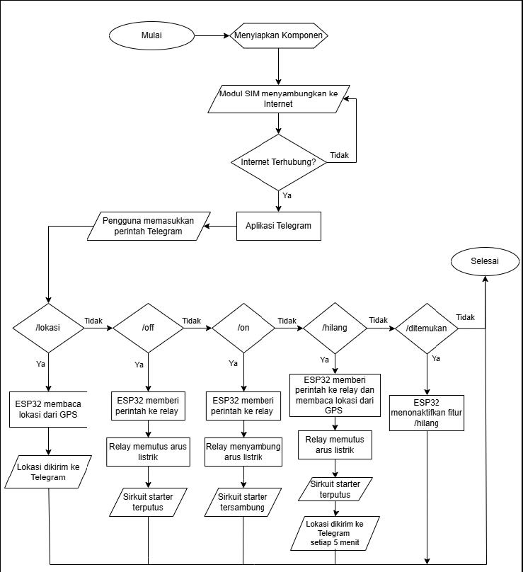

# Alat Pengaman Motor Menggunakan ESP32 dengan Kontrol Jarak Jauh Melalui Telegram

Sistem keamanan motor berbasis IoT menggunakan ESP32, GPS NEO-6M, dan SIM800L yang dapat dikontrol jarak jauh melalui **Telegram**. Proyek ini merupakan **Laporan Akhir** sebagai syarat kelulusan.

---

## Tentang Proyek

Alat ini dirancang untuk meningkatkan keamanan kendaraan bermotor dengan memanfaatkan teknologi IoT. Pengguna dapat mengontrol relay (memutus/menyambung sirkuit starter motor) serta melacak lokasi kendaraan secara real-time melalui bot Telegram.

### Fitur Utama
1. **Kontrol Relay Jarak Jauh** — Nyalakan atau matikan starter motor dari mana saja melalui perintah Telegram (`/on`, `/off`).
2. **Pelacakan Lokasi GPS** — Dapatkan lokasi motor secara real-time dengan perintah `/lokasi`, langsung tampil di Google Maps.
3. **Mode Kehilangan** — Aktifkan mode `/hilang` untuk memutus starter otomatis dan mengirim lokasi GPS berkala setiap 5 menit ke Telegram.
4. **Auto-Reconnect** — Koneksi GPRS otomatis pulih jika terjadi gangguan sinyal.

### Alur Perintah Telegram

| Perintah | Fungsi |
|----------|--------|
| `/on` | Menyambung arus starter → motor bisa dinyalakan |
| `/off` | Memutus arus starter → motor tidak bisa dinyalakan |
| `/lokasi` | Mengirim lokasi GPS saat ini via Google Maps |
| `/hilang` | Memutus starter + kirim lokasi otomatis setiap 5 menit |
| `/ditemukan` | Menonaktifkan mode kehilangan |

---

## Screenshots

### Alat Pengaman Motor


### Desain Alat


### Prototipe Rancangan Alat


### Skematik Rancangan Alat


### Flowchart Sistem


---

## 🎬 Video Pengujian

[](https://youtu.be/wvvGStXH7Ok)

🔗 **Tonton video pengujian lengkap:** [https://youtu.be/wvvGStXH7Ok](https://youtu.be/wvvGStXH7Ok)

---

## Daftar Komponen

| No | Komponen | Jumlah |
|----|----------|--------|
| 1 | ESP32 – 30 Pin | 1 |
| 2 | Modul GPS NEO-6M | 1 |
| 3 | Modul GSM SIM800L V2 | 1 |
| 4 | Modul Relay 5V 1 Channel | 1 |
| 5 | Regulator Tegangan LM2596 | 1 |
| 6 | Aki Motor 12V | 1 |
| 7 | Kabel Jumper | Secukupnya |
| 8 | Transistor NPN (BC547) | 1 |
| 9 | Resistor 220 Ohm | 1 |
| 10 | Kapasitor 2200µF 16V | 2 |

## Wiring / Koneksi Pin

| Modul | Pin Modul | Pin ESP32 |
|-------|-----------|-----------|
| SIM800L | TXD | GPIO 26 |
| SIM800L | RXD | GPIO 27 |
| GPS NEO-6M | TX | GPIO 16 |
| GPS NEO-6M | RX | GPIO 17 |
| Relay 5V | IN | GPIO 15 |
| LED (built-in) | - | GPIO 2 |

---

## Tech Stack

| Teknologi | Keterangan |
|-----------|------------|
| ESP32 | Mikrokontroler utama |
| Arduino IDE | Platform pemrograman |
| SIM800L | Modul GSM/GPRS untuk koneksi internet |
| GPS NEO-6M | Modul pelacakan lokasi |
| Telegram Bot | Antarmuka kontrol pengguna |

---

## ⚠️ Penting: Tentang Backend Server

Proyek ini membutuhkan **server backend (VPS)** sebagai perantara antara ESP32 dan Telegram Bot. Server backend yang digunakan dalam proyek asli bersifat **private dan tidak disertakan** dalam repository ini.

**Yang di-share di repo ini hanya kode Arduino/ESP32 saja.**

Jika kamu ingin menggunakan proyek ini, kamu perlu **mengembangkan backend server sendiri** dengan minimal 2 endpoint:
- `cmd.php` — Menyimpan & mengirim perintah dari Telegram ke ESP32
- `update_status.php` — Menerima status/lokasi dari ESP32 dan meneruskan ke Telegram

Lalu ganti URL di kode Arduino:
```cpp
constexpr char URL_GET[]  = "http://YOUR-SERVER-IP/cmd.php?clear=1";
constexpr char URL_POST[] = "http://YOUR-SERVER-IP/update_status.php";
```

---

## Cara Menggunakan

### Prasyarat
- **Arduino IDE** dengan board ESP32 terinstall
- **Library** yang dibutuhkan:
  - `TinyGPS++` (untuk GPS NEO-6M)
- Kartu SIM dengan paket data aktif (untuk SIM800L)
- Server/VPS sendiri untuk backend (lihat bagian di atas)

### Langkah-Langkah

**1. Clone Repository**
```bash
git clone https://github.com/AniffXP/Pengaman-Motor-ESP32.git
```

**2. Buka di Arduino IDE**
- Buka file `esp32_pengaman_motor/esp32_pengaman_motor.ino`
- Install library **TinyGPS++** via Library Manager

**3. Konfigurasi**
- Sesuaikan APN sesuai provider kartu SIM:
  ```cpp
  constexpr char APN[] = "internet"; // Ganti sesuai provider
  ```
- Ganti `YOUR-SERVER-IP` dengan alamat VPS/server backend milikmu

**4. Upload ke ESP32**
- Pilih board: **ESP32 Dev Module**
- Pilih port COM yang sesuai
- Klik **Upload**

**5. Rangkai Hardware**
- Ikuti diagram rangkaian di folder `screenshots/`
- Pastikan regulator LM2596 di-set ke **5V** sebelum menyambungkan ke ESP32

---

## Struktur Folder

```
Pengaman-Motor-ESP32/
├── esp32_pengaman_motor/
│   └── esp32_pengaman_motor.ino   # Kode utama ESP32
├── screenshots/
│   ├── Alat Pengaman Motor.jpg       # Foto alat jadi
│   ├── desain alat.jpg               # Diagram rangkaian
│   ├── prototipe rancangan alat.jpg  # Foto prototipe alat
│   ├── skematik rancangan alat.jpg   # Skema pinout
│   └── flowchart.jpg                 # Flowchart alur kerja
└── README.md                         # Dokumentasi proyek
```

---

## Alur Kerja Sistem

```
Telegram Bot → Server Backend (private) → ESP32 (polling tiap 10 detik)
                                                ↓
                                          Proses Perintah
                                         ↙   ↓    ↓    ↘
                                       /on  /off /lokasi /hilang
                                        ↓    ↓     ↓       ↓
                                     Relay  Relay  GPS   Relay OFF
                                      ON    OFF   Read   + GPS tiap
                                                   ↓     5 menit
                                                Kirim
                                                ke Bot
```

---

## 👤 Developer

**Abdurrahman Hanif**
- 📧 ahanif562@gmail.com
- 🔗 [GitHub](https://github.com/AniffXP)
- 💬 https://t.me/anonyxpp

---

## 📄 Lisensi

Project ini merupakan bagian dari **Laporan Akhir** sebagai syarat kelulusan.
